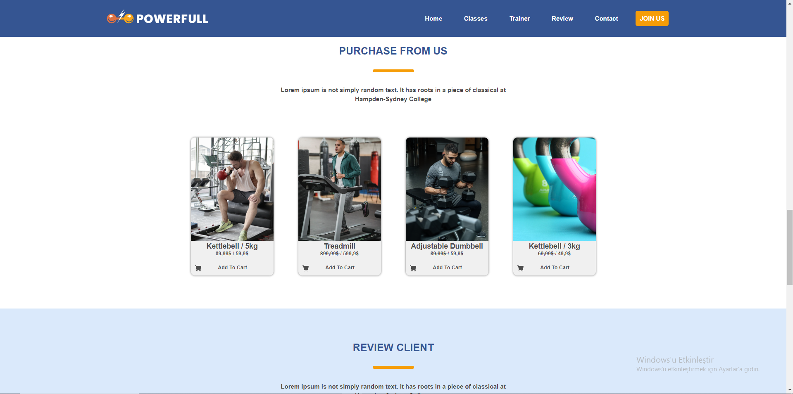

 # Sports Center Website

## Project Overview
This project is a website for a sports center where users can view events, register for activities, and manage their membership information. It aims to provide convenience for sports enthusiasts with its user-friendly interface and functional features.

## Features
- Event calendar
- Membership registration and management
- Event registration
- User profile page
- Contact form

## Technologies
- HTML
- CSS
- JavaScript

## Screen Shots





## Installation
1. Clone this repository:
   ```bash
   git clone https://github.com/emrecimen20/Sports_Center.git